# Why JB

> 当我谈 Justin Bieber 时我们谈些什么

记得清楚第一首是初二时某教育实践基地一同学唱的 **baby**，随即开始有一搭没一搭地听。

近十年前，初中学校的压力还是挺小，如今看来可谓散漫，家住二楼，三班教室在一楼，五分钟到；每天七点到下午六点，作业在校完成，回家循环 **as long as you love me** 和 **never say never**。老师寄予厚望，甚是关照，中考差两分错失市中。都是后话。彼时扫黑，平日聚在校门的社会青年们有天突然不见踪影。
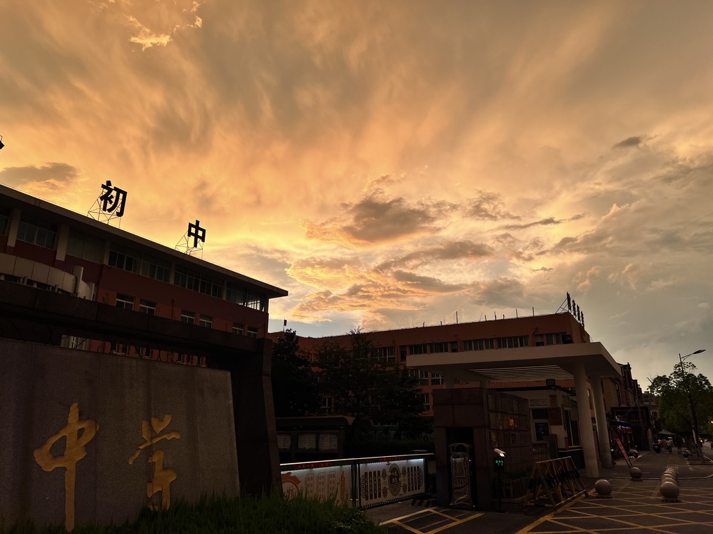

那段时间倒是 Alan Walker 的创作巅峰期，快放学时会有活泼的同学用大屏播 alone 和 all falls down；周末最是愉快，一个人在家，不补课，电视放着爱情公寓作白噪音，奈何实在 get 不到国民游戏的乐趣，打打单机也足以自娱。
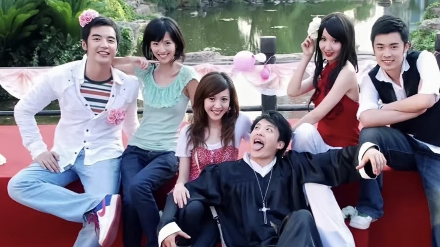

没多久听到 **despacito**、**purpose**、**company**、**let me love you**，惊艳有余。在学校里哼 **what do u mean**、**sorry**，同学也会心一笑，时不时回味 **2U**、**friends**、**love me**、**home to mama**……与此同时，房地产风光无限，互联网开枝散叶，短视频平地而起，我知道的第一条抖音是唱 that girl 的中学男孩。
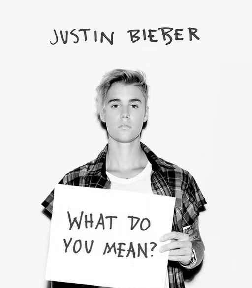
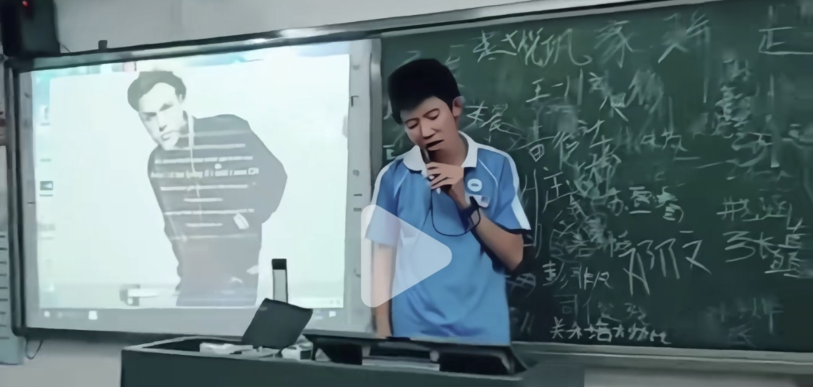

18 年，19 岁的姆巴佩赢了。

> 岁月顺遂平淡。经济周期是只在新闻里听到的词语。

很快上高中，旧友分离。那年暑假放的是日剧《非正常死亡》，lemon 登榜，遂接触沉迷 Jpop 和小语种，也许这不管歌词大义、只享受旋律也极贴合青春期的情绪与心理。没多久 JB 和 Billie 出了 **bad guy**，很好听。
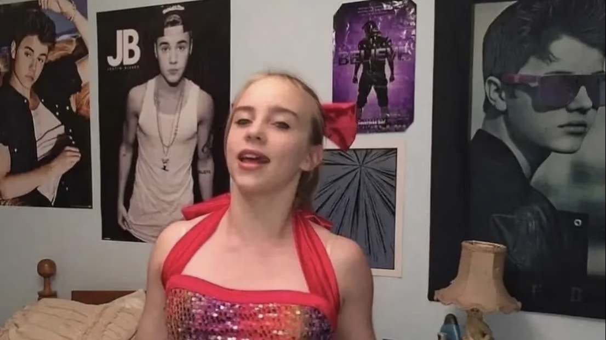

> 2020。凝固的空气与生命。

祖父因为肺部疾病离开了，与病毒无关。没问过具体病因，不过小学时回老家他总是烟不离嘴，长大后很少回去。这也成为后来听 **ghost** 的回忆碎片。

**10,000hours**、**come around me**、**yummy**、**intentions**，婚后出的歌曲听来风格焕然一新。偶尔听听以前的老歌也有点厌倦了。

**peaches**、**lonely**、**stuck with u**、**the feeling**、**mood**、**holy**、**hold on** 在非正常的假期里做伴。最火的是 **stay**。期间家人朋友平安无恙。
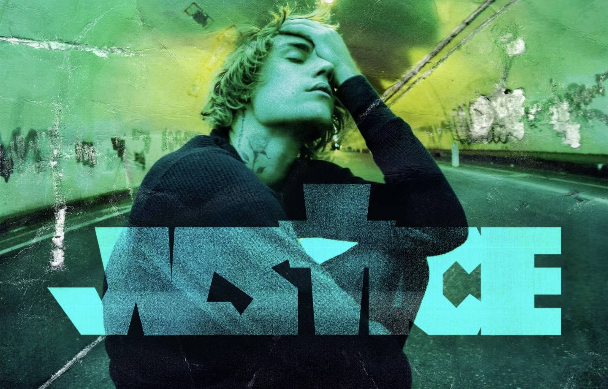

22 年底终是阳了，补看了世界杯决赛。

很快便是高考，懵懂地做选择。

大学学了吉他，**off my face** 很合其音色。同年许家印被带走。三年后判了无期。英语老师在圣诞 eve 放 **mistletoe**，至今没遇过那年冬天的大雪。
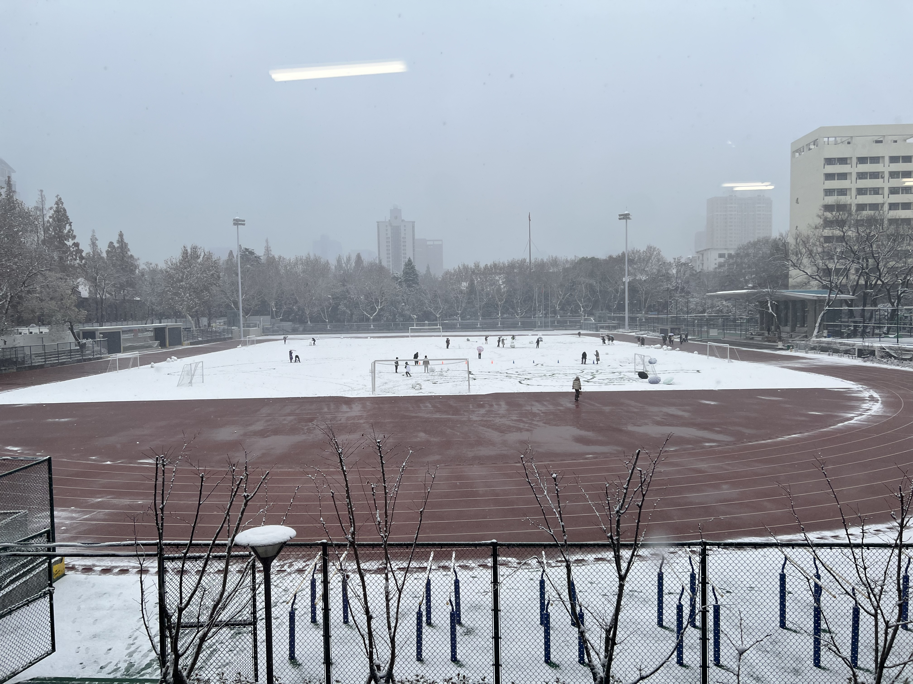

但更多听的是陈奕迅，很欣赏他词曲的神来之笔。某次 KTV 朋友唱 **monster** 和 **cold water**，很对我的胃口。
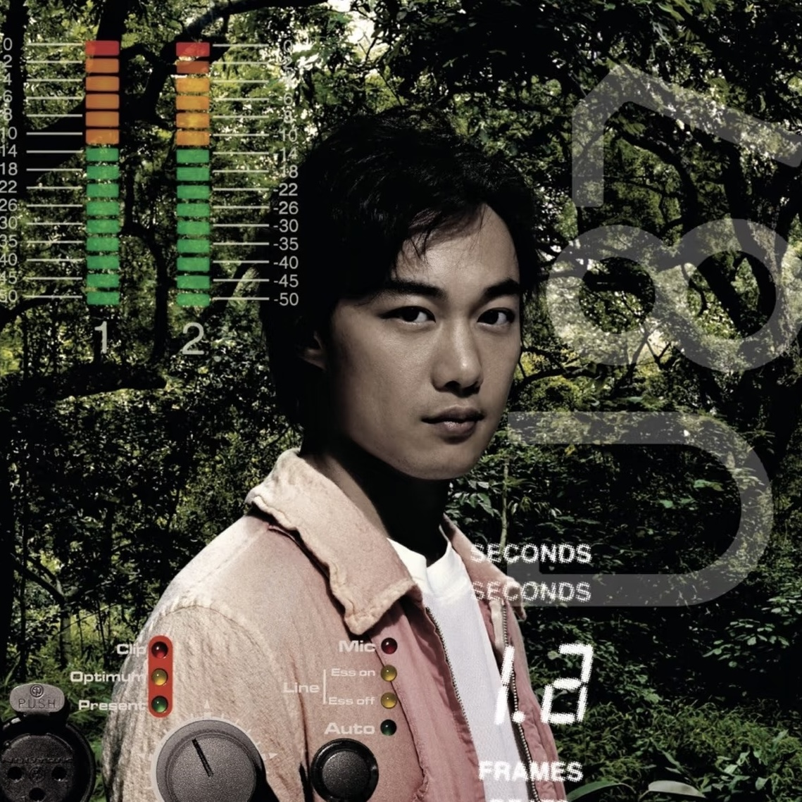

25 年六月，一些心事，反复循环的 Alec Benjamin 与夏日的教室、偶有的雷雨绑定在心底。偶尔会听 **love yourself**。

期间，聚散来去，渐渐学会淡然处之。

有天小兰的 CV 去世了，忽然想起从前每年要去的剧场版也很久没看。
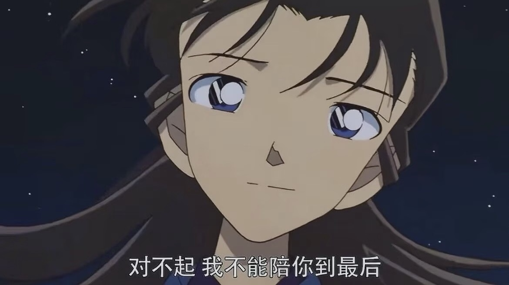

……

所以怀念什么？

那里仿佛存在一道清晰、精准的分割线，此前的作品一律带着夏日的气息，轻快明媚如 freshmen；而后即使是同类型的也令人看不清底色，如同蒙上一层薄纱，不可同语。

再看 10 年代的作品，仿佛能将人短暂带回那个 golden age：父母身体、事业都正值壮年，一切生机蓬勃，人们兴奋的讨论人生规划、财富自由。一晃眼到现实，新的显学甚嚣尘上，一笑过后，继续自己的生活。

26 科切拉唱了 **beauty and a beat** 和 **baby**，繁荣又消费主义年代的 MV 短暂重现荧幕。人群在欢呼，或许期冀某些东西的回归。
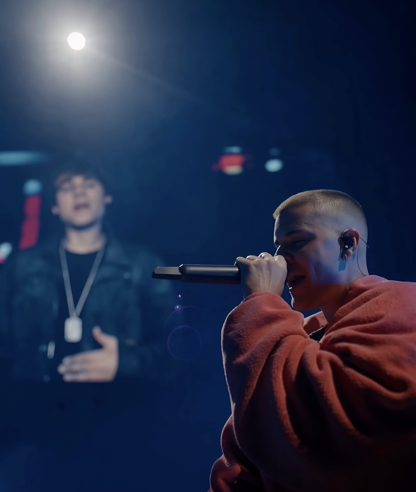
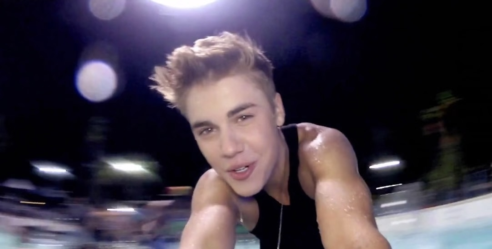

大三暑假，和朋友买酒在宿舍看了世界杯，没有表演转播权，事后才得知 JB 上场演奏，他现在看着成熟到有点沧桑。我们几个也许很快也是。
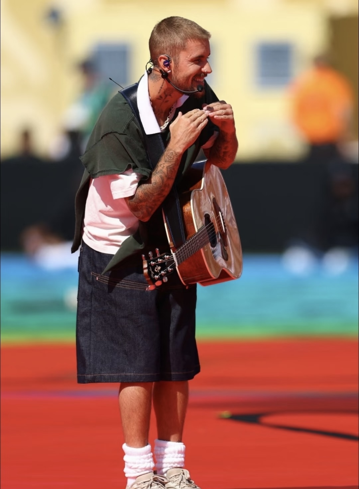

朦胧困意中，西班牙夺冠，新一代的年轻人击溃阿根廷。美国总统和初中一样，还是川普。
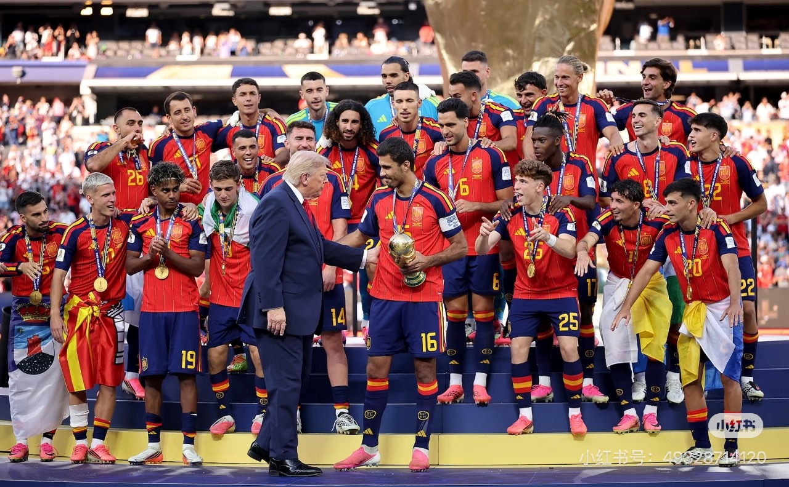

次日早起实习去，竟一整天没觉得困。
